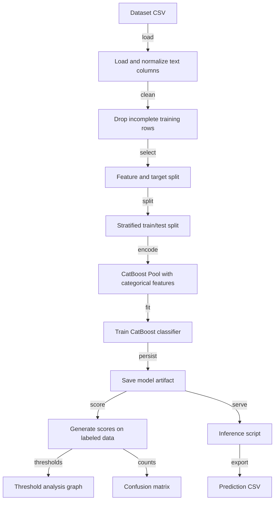

# CatBoost Model Flow

```mermaid
flowchart TD
    A[Dataset CSV] -->|load| B[Load and normalize text columns]
    B -->|clean| C[Drop incomplete training rows]
    C -->|select| D[Feature and target split]
    D -->|split| E[Stratified train/test split]
    E -->|encode| F[CatBoost Pool with categorical features]
    F -->|fit| G[Train CatBoost classifier]
    G -->|persist| H[Save model artifact]
    H -->|score| I[Generate scores on labeled data]
    I -->|thresholds| J[Threshold analysis graph]
    I -->|counts| K[Confusion matrix]
    H -->|serve| L[Inference script]
    L -->|export| M[Prediction CSV]
```
